# CAPSTONE-1-EDA
Dataset case study including EDA, hypothesis testing, and visualizations
_______________________________________
# [Airbnb Listings and Metrics in NYC (2019)](https://www.kaggle.com/dgomonov/new-york-city-airbnb-open-data)
* This dataset contains information regarding Airbnb rentals in NYC for 2019. I am interested in investigating the following:

  * Hosts across neighborhood/neighborhood group
  * Room type across neighborhood/neighborhood group
  * Price across neighborhood/borough
  * Availability
  * Number of reviews

* ### Visualizations to Consider:
  * Distributions of prices across neighbohood/borough
  * Distributions of minimum nights across neighborhood/borough
  * Distribution of reviews across neighborhood/borough
  * Amount of listings per host across neighborhood/borough
  * Correlation between amount of listings per host and availability
  * Map plot that shows concentration of listings throughout the city based on latitude/longitude coordinates

* ### Hypotheses to Consider:
  * Whether certain neighborhods/boroughs have higher availability/amount of listings per host
  * Differences in pricing between neighborhoods/boroughs
  * Differences in pricing between hosts who have varying amounts of listings

-------------------------------------------

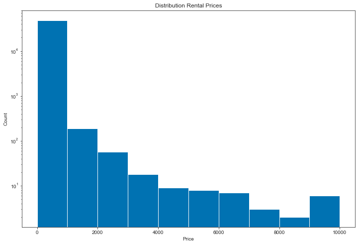

-------------------------------------------
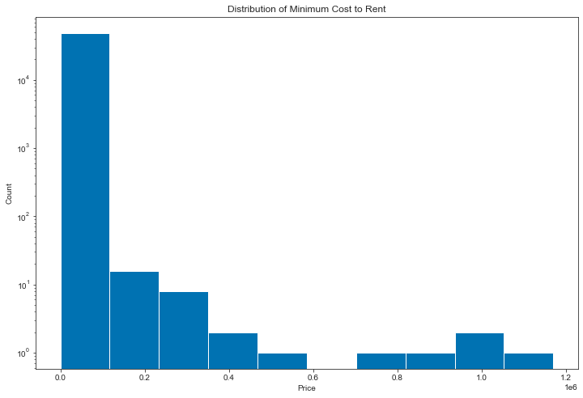

-------------------------------------------

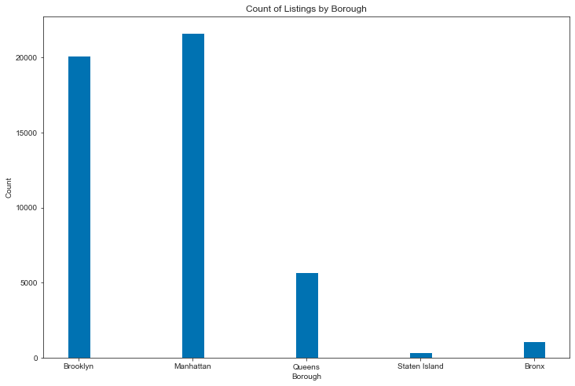

--------------------------------------------

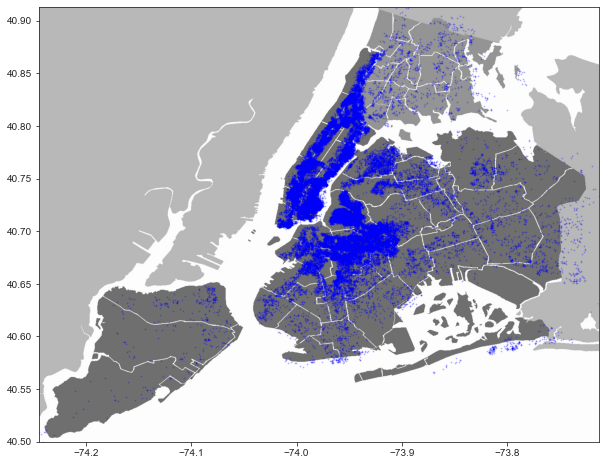

-------------------------------------------

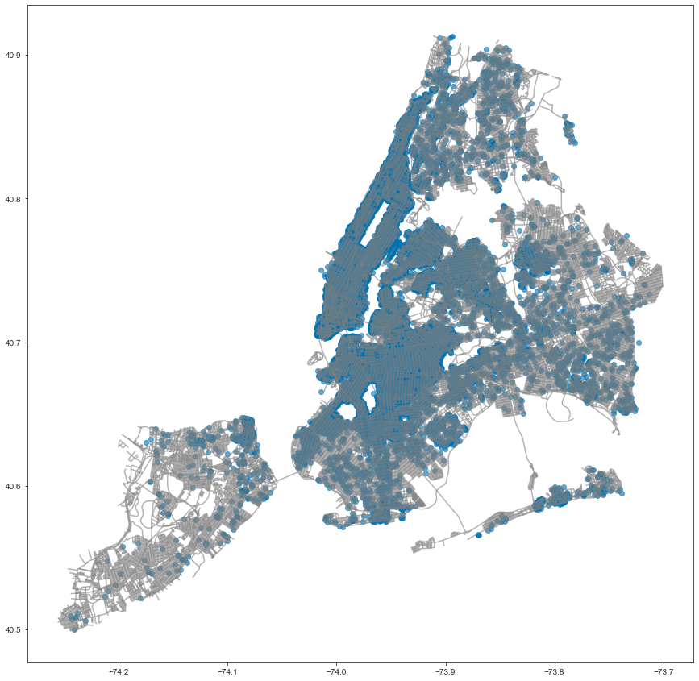

------------------------------------------

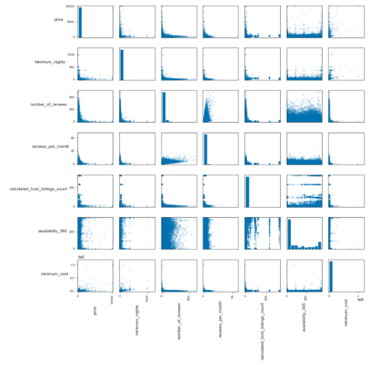

------------------------------------------

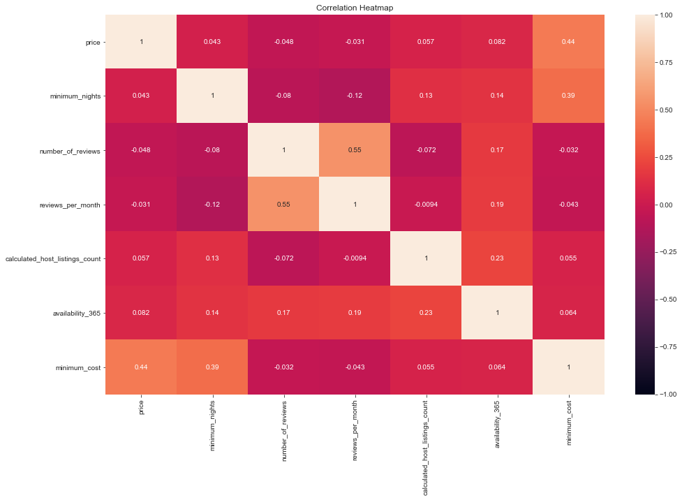

-----------------------------------------

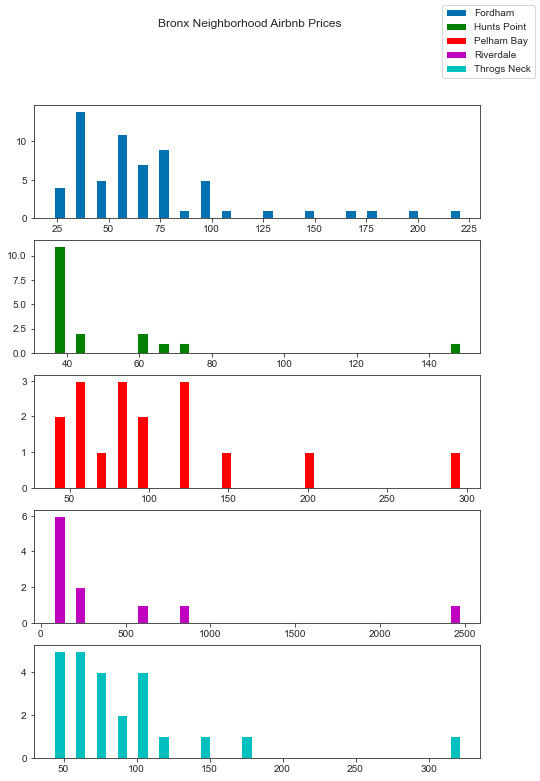

------------------------------------------

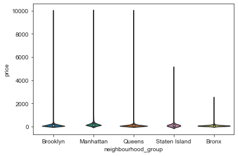

------------------------------------------

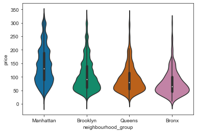

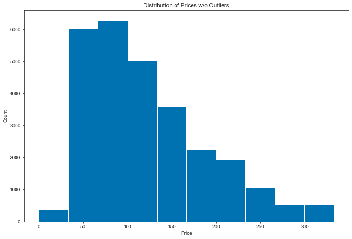

------------------------------------------
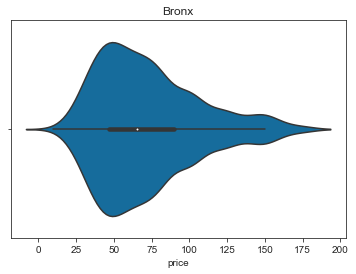

------------------------------------------

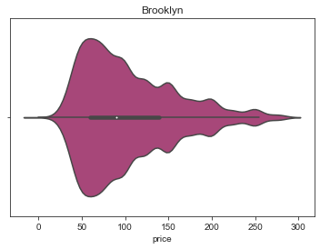

-------------------------------------------

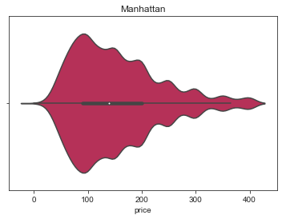

-------------------------------------------

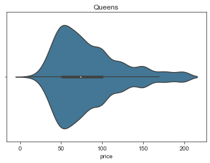

-------------------------------------------

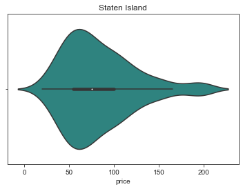

-------------------------------------------

# Hypothesis Testing:
* I ran a t-test on mean prices for each borough vs. every other borough to see what's significant and what isn't with an alpha of 0.05 across the board:

------------------------------------------
### Null-Hypothesis1: Bronx rental prices = Brooklyn rental prices
### Alt-Hypothesis1: Bronx rental prices != Brooklyn rental prices

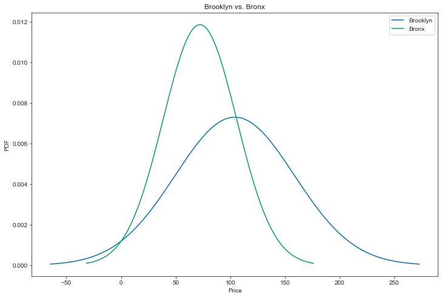

* The statistic is: -22.928618135457267
* The P-value is: 3.372692554424379e-92

The P-value is much smaller than our threshold of 0.05, so I can reject the null hypothesis

------------------------------------------
### Null-Hypothesis2: Brooklyn rental prices = Manhattan rental prices 
### Alt-Hypothesis2: Brooklyn rental prices != Manhattan rental prices

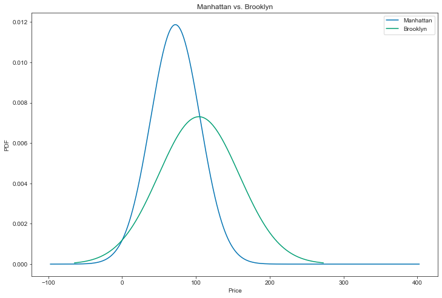

* The statistic is: -54.277389156640076
* The P-value is: 0.0

The P-value is much smaller than our threshold of 0.05, so I can reject the null hypothesis

------------------------------------------
### Null-Hypothesis3: Brooklyn rental prices = Queens rental prices
### Alt-Hypothesis3: Brooklyn rental prices != Queens rental prices
* The statistic is: 24.63607892282018
* The P-value is: 2.532811850514098e-129

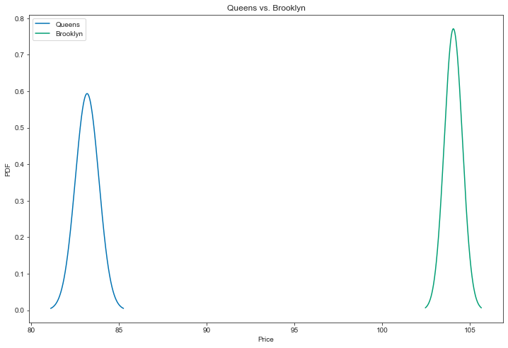

The P-value is much smaller than our threshold of 0.05, so I can reject the null hypothesis

------------------------------------------
### Null-Hypothesis4: Brooklyn rental prices = Staten Island rental prices
### Alt-Hypothesis4: Brooklyn rental prices != Staten Island rental prices

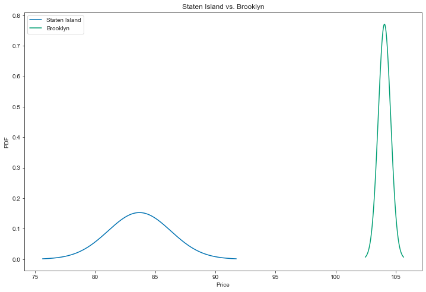

* The statistic is: 7.665457848815302
* The P-value is: 3.7007331126954127e-13

The P-value is much smaller than our threshold of 0.05, so I can reject the null hypothesis

-------------------------------------------
### Null-Hypothesis5: Staten Island rental prices = Bronx rental prices
### Alt-Hypothesis5: Staten Island rental prices != Bronx rental prices

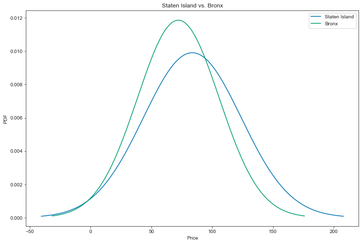

* The statistic is: 3.951188209546539
* The P-value is: 9.360702967221851e-05

The P-value is much smaller than our threshold of 0.05, so I can reject the null hypothesis

-------------------------------------------
### Null-Hypothesis6: Staten Island rental prices = Manhattan rental prices
### Alt-Hypothesis6: Staten Island rental prices != Manhattan Island rental prices

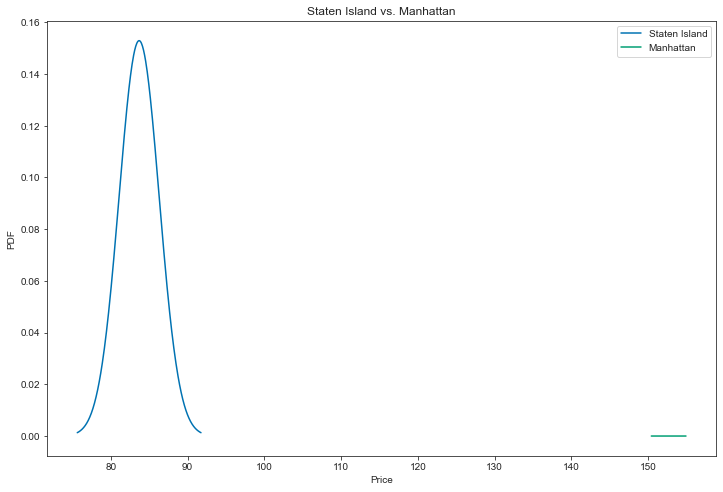

* The statistic is: -25.47038174024267
* The P-value is: 2.125131575170887e-74

We can reject the null hypothesis

-------------------------------------------
### Null-Hypothesis7: Queens rental prices = Bronx rental prices
### Alt-Hypothesis87: Queens rental prices != Bronx rental prices

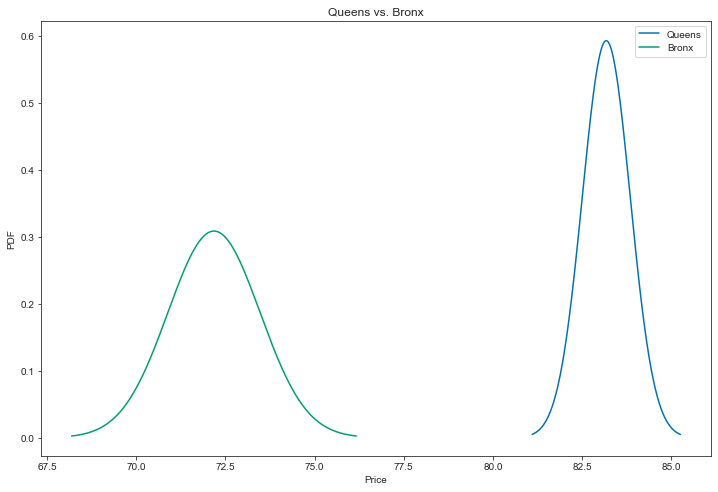

* The statistic is: 7.554233389613039
* The P-value is: 8.961968526929802e-14

The P-value is much smaller than our threshold of 0.05, so I can reject the null hypothesis

-------------------------------------------
### Null-Hypothesis8: Queens rental prices = Manhattan rental prices
### Alt-Hypothesis8: Queens rental prices != Manhattan Island rental prices

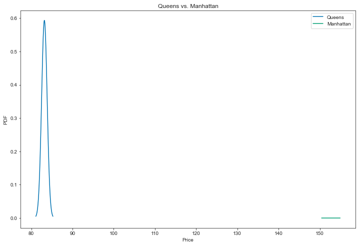

* The statistic is: -69.9890080361625
* The P-value is: 0.0

The P-value is much smaller than our threshold of 0.05, so I can reject the null hypothesis

-------------------------------------------

### Null-Hypothesis9: Bronx rental prices = Manhattan rental prices
### Alt-Hypothesis9: Bronx rental prices != Manhattan Island rental prices

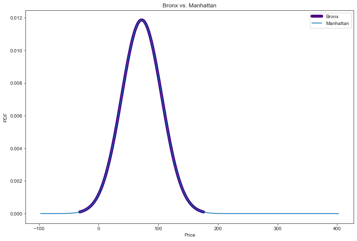

* The statistic is: -54.26185019782024
* The P-value is: 2.57e-322

The P-value is much smaller than our threshold of 0.05, so I can reject the null hypothesis

------------------------------------------

### Null-Hypothesis10: Staten Island rental prices = Queens rental prices
### Alt-Hypothesis10: Staten Island rental prices != Queens rental prices

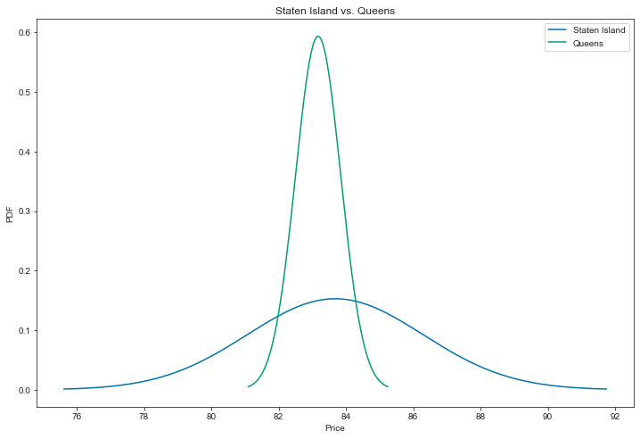

* The statistic is: 0.1879669104597021
* The P-value is: 0.8510440821111774

**We actually fail to reject the null
hyothesis here because the P-value doesn't meet the threshold of 0.05**

