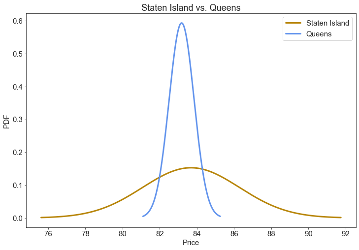

# CAPSTONE-1-EDA
Dataset case study including EDA, hypothesis testing, and visualizations
_______________________________________
# [Airbnb Listings and Metrics in NYC (2019)](https://www.kaggle.com/dgomonov/new-york-city-airbnb-open-data)
* This dataset contains information regarding Airbnb rentals in NYC for 2019. I am interested in investigating the following:

  * Hosts across neighborhood/neighborhood group
  * Room type across neighborhood/neighborhood group
  * Price across neighborhood/borough
  * Availability
  * Number of reviews

* ### Visualizations to Consider:
  * Distributions of prices across neighbohood/borough
  * Distributions of minimum nights across neighborhood/borough
  * Distribution of reviews across neighborhood/borough
  * Amount of listings per host across neighborhood/borough
  * Correlation between amount of listings per host and availability
  * Map plot that shows concentration of listings throughout the city based on latitude/longitude coordinates

* ### Hypotheses Considered:

  * Differences in pricing between neighborhoods/boroughs
  * The probability that a particular borough will have more instances of `has review` when compared to another

-------------------------------------------

Let's take a look at the distribution of prices across all boroughs.


A few noteworthy things at a first glance:
* There appears to be pricing outliers that are positively skewing the distribution
* The pricing does not appear to be normally distributed.

-------------------------------------------

Because many listings have a minimum number of required nights > 1, it may be worth look at the distribution of `minimum cost`


Again, the distribution looks positively skewed.

-------------------------------------------

It's likely that some boroughs have way more listings than others. Let's take a look at the distribution of listings across borough.


--------------------------------------------

What do these listings look like on a map?
The below graph is my first attempt and plotting the listings to get a more visual understanding of the distribution across the city.


As we can see, the plotting doesn't seem to be very accurate, as evidenced by the several Rockaway Beach listings in the Atlantic Ocean. This plot was created without the help of GeoPandas, so let's see what it looks like with GeoPandas.

-------------------------------------------

## With GeoPandas


We can see plotting the longitude and latitude coodinates with GeoPandas and a map taken from NYC OpenData is way more accurate. 

------------------------------------------

There are quite a few columns in this dataset, so I put together a scatter-matrix to visually determine if there are any noticible relationships between the following columns:
* `neighbourhood_group`
* `neighbourhood`
* `room_type`
* `price`
* `minimum_nights`
* `number_of_reviews`
* `reviews_per_month`
* `calculated_host_listings_count`
* `availability_365`
* `minimum_cost`


From just eyeballing the scatter-matrix, there don't seem to be any significant relationships between any of the columns above.

------------------------------------------

Let's get the actual Pearson correlation coefficient for each variable against all other variables:


There don't seem to be any strong relationships between variables, but there are some weaker relationships:
* `calculated_host_listings_count` and `minimum_nights` = 0.13
*  `calculated_host_listings_count` and `availability_365` = 0.23

It seems that when the host listings count increases, there's slight increase in minimum nights required to stay at a particular listing.

Similarly, when the host listings count increases, there's a slight increase in availability throughout the year.

------------------------------------------
## Pricing Differences

Let's take a look at the pricing differences between boroughs.

Remember earlier when there appeared to be outliers positively skewing the distribution of prices? Let's confirm that:


As we an see from this violin plot, there are deffinitely pricing outliers.

I decided to remove the outliers by calculating the interquartile range (IQR),Q3-Q1, and removing any value that is less than Q1 - 1.5*IQR and greater than Q3 + 1.5*IQR

------------------------------------------

Let's see what the distribution of prices looks like without outliers...


MUCH BETTER

Below we can see the distribution of rental prices across each borough.

-------------------------------------------
# Hypothesis Testing:

I decided to take a closer look at the differences in mean price across each borough. Earlier, it didn't look like the prices were normally distributed, but let's confirm that mathematically by testing for normality:

H0: Price values are not normally distributed
H1: Price values are normally distributed

- I'm establishin an alpha of 0.05, if the p-value is above the alpha, we can reject the null hypothesis. If below, we must fail to reject the null hypothesis. 

```python
stat, p = stats.normaltest(airbnb_nooutliers['price'])
```

The statistic is 2845.656175505129
The P-value is 0.0

This means that we fail to reject the null hypothesis and the normality test has determined the price values are NOT normally distributed.

Because of the Central Limit Theorem, we can still do hypothesis testing under the assumption that the sample means are normally distributed. Similarly, we can still perfrom t-tests on the mean borough prices because the t-test assumes the means of samples are normally distributed, and it does not asume that the population is normally distributed. Additionally, we are dealing with some rather large sample sizes, so treating the sample means as normally distributed is not an issue.

* I ran a t-test on mean prices for each borough vs. every other borough to see what's significant and what isn't with an alpha of 0.05 across the board.

The 10 following hypothesis tests were conducted:

| H0  	|   H1	|
|---	|---	|
| The mean rental price in The Bronx is not significantly different than the mean rental price in Brooklyn   	| The mean rental price in The Bronx is significantly different than the mean rental price in Brooklyn  	|
| The mean rental price in Brooklyn is not significantly different than the mean rental price in Manhattan  	| The mean rental price in Brooklyn is significantly different than the mean rental price in Manhattan   	|
| The mean rental price in Brooklyn is not significantly different than the mean rental price in Queens  	| The mean rental price in Brooklyn is significantly different than the mean rental price in Queens  	|
| The mean rental price in Brooklyn is not significantly different than the mean rental price in Staten Island  	| The mean rental price in Brooklyn is significantly different than the mean rental price in Staten Island  	|
| The mean rental price in Staten Island is not significantly different than the mean rental price in The Bronx  	| The mean rental price in Staten Island is significantly different than the mean rental price in The Bronx   	|
| The mean rental price in Staten Island is not significantly different than the mean rental price in Manhattan  	| The mean rental price in Staten Island is significantly different than the mean rental price in Manhattan   	|
| The mean rental price in Queens is not significantly different than the mean rental price in The Bronx   	| The mean rental price in Queens is significantly different than the mean rental price in The Bronx   	|
| The mean rental price in Queens is not significantly different than the mean rental price in Manhattan  	| The mean rental price in Queens is significantly different than the mean rental price in Manhattan  	|
| The mean rental price in the Bronx is not significantly different than the mean rental price in Manhattan   	| The mean rental price in the Bronx is significantly different than the mean rental price in Manhattan  	|
| The mean rental price in Staten Island is not significantly different than the mean rental price in Queens  	| The mean rental price in Staten Island is significantly different than the mean rental price in Queens  	|


### We can reject the Null Hypothesis in 9/10 of the tests because the P-value fell far below our alpha of 0.05

------------------------------------------

**We actually fail to reject the null
hyothesis when comparing Staten Island and Queens mean rental prices because the P-value doesn't meet the threshold of 0.05**



* The statistic is: 0.1879669104597021
* The P-value is: 0.8510440821111774

**We actually fail to reject the null
hyothesis here because the P-value doesn't meet the threshold of 0.05**

------------------------------------------

## Bayes Testing on "Has Review"

Owners who are interested in potentially listing their property might want to know which borough is more likely to get a review.

I created an additional collumn called `has_review` that has a value of 0 if `numer_of_reviews` for a listing is 0 and 1 if there are any reviews at all.

I then performed Bayesian Hypothesis testing using 100,000 simulations using the Beta Distribution for each borough:

### Null Hypothesis1: A Brooklyn listing is no more likely to get a review than a Bronx listing.
### Alt Hypothesis1: A Brooklyn listing is more likely to get a review than a Bronx listing.

* Brooklyn > Bronx: 0.89085
  * the probability that a Brooklyn listing has more instances of `has_review` than a Bronx listing is roughly 89% 

### Null Hypothesis2: A Brooklyn listing is no more likely to get a review than a Manhattan listing.
### Alt Hypothesis2: A Brooklyn listing is more likely to get a review than a Manhattan listing.

* Brooklyn > Manhattan: 1.0
  * the probability that a Brooklyn listing has more instances of `has_review` than a Manhattan listing is roughly 100% 

### Null Hypothesis3: A Brooklyn listing is no more likely to get a review than a Queens listing.
### Alt Hypothesis3: A Brooklyn listing is more likely to get a review than a Queens listing.

* Brooklyn > Queens: 0.96653
  * the probability that a Brooklyn listing has more instances of `has_review` than a Queens listing is roughly 97%

### Null Hypothesis4: A Brooklyn listing is no more likely to get a review than a Staten Island listing.
### Alt Hypothesis4: A Brooklyn listing is more likely to get a review than a Staten Island listing.

* Brooklyn > Staten Island: 0.10527
  * the probability that a Brooklyn listing has more instances of `has_review` than a Staten Island listing is roughly 11%

### Null Hypothesis5: A Staten Island listing is no more likely to get a review than a Bronx listing.
### Alt Hypothesis5: A Staten Island listing is more likely to get a review than a Bronx listing.

* Staten Island > Bronx: 0.95693
  * the probability that a Staten Island listing has more instances of `has_review` than a Bronx listing is roughly 96%

### Null Hypothesis6: A Staten Island listing is no more likely to get a review than a Manhattan listing.
### Alt Hypothesis6: A Staten Island listing is more likely to get a review than a Manhattan listing.

* Staten Island > Manhattan: 0.99977
  * the probability that a Staten Island listing has more instances of `has_review` than a Manhattan listing is roughly 100%

### Null Hypothesis7: A Queens listing is no more likely to get a review than a Bronx listing.
### Alt Hypothesis7: A Queens listing is more likely to get a review than a Bronx listing.

* Queens > Bronx: 0.62343
  * the probability that a Queens listing has more instances of `has_review` than a Bronx listing is roughly 62%

### Null Hypothesis8: A Queens listing is no more likely to get a review than a Manhattan listing.
### Alt Hypothesis8: A Queens listing is more likely to get a review than a Manhattan listing.

* Queens > Manhattan: 1.0
  * the probability that a Queens listing has more instances of `has_review` than a Manhattan listing is roughly 100%

### Null Hypothesis9: A Bronx listing is no more likely to get a review than a Manhattan listing.
### Alt Hypothesis9: A Bronx listing is more likely to get a review than a Manhattan listing.

* Bronx > Manhattan: 0.99709
  * the probability that a Bronx listing has more instances of `has_review` than a Manhattan listing is roughly 100%

### Null Hypothesis10: A Staten Island listing is no more likely to get a review than a Queens listing.
### Alt Hypothesis10: A Staten Island listing is more likely to get a review than a Queens listing.

* Staten Island > Queens: 0.95747
  * the probability that a Staten Island listing has more instances of `has_review` than a Queens listing is roughly 96%

Let's see what the difference in `has_review` looks like when plotting the PDFs of each borough's Beta Distribution:


